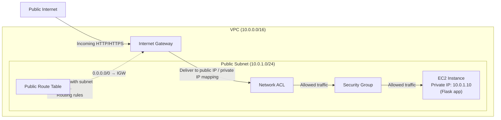
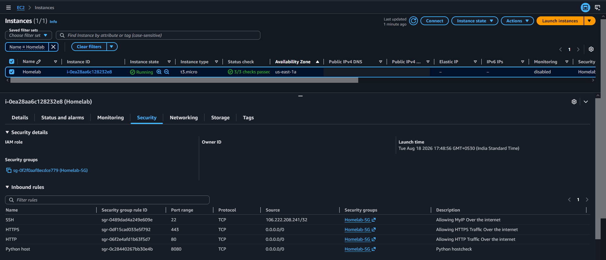
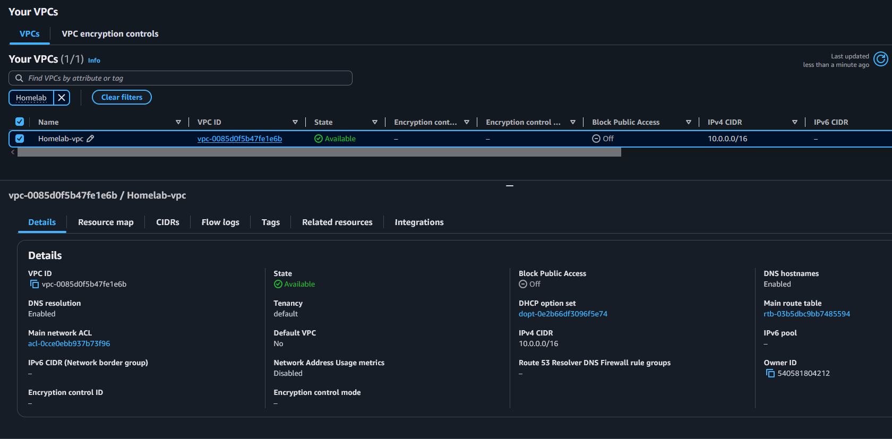
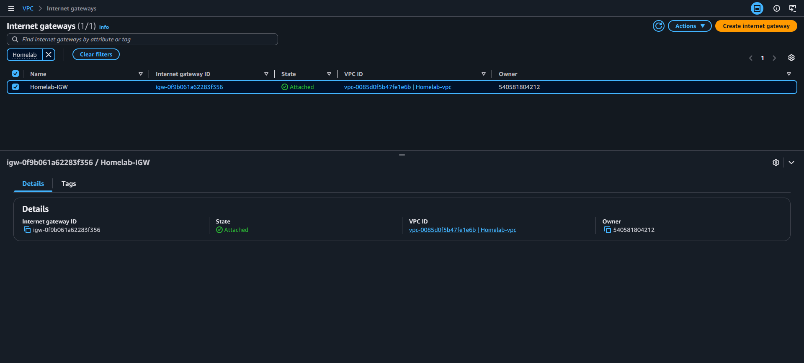
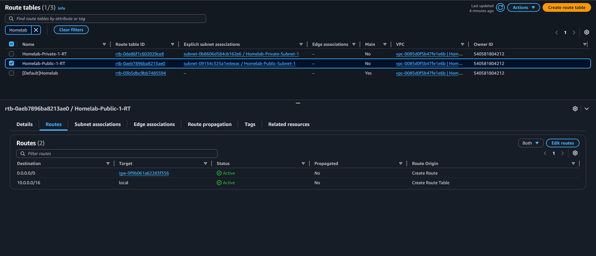
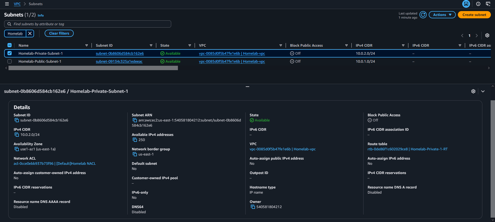
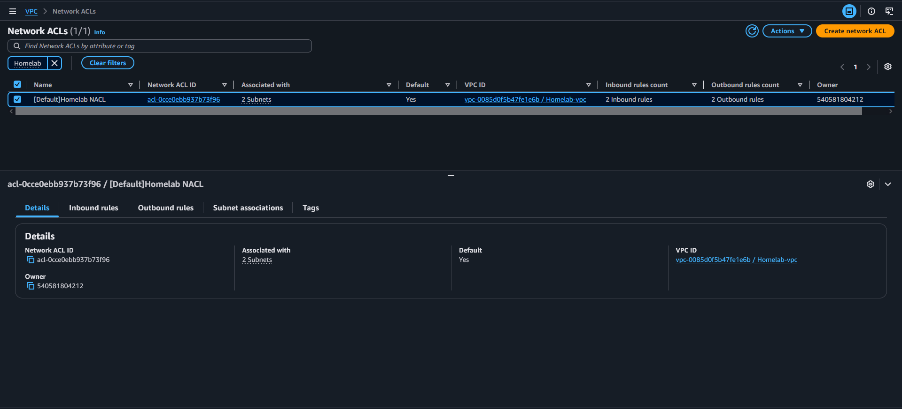
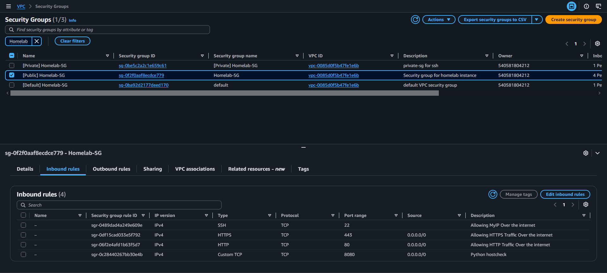

# 🚀 Project 03 – VPC (Virutal Private Cloud)

**Motto — VPC First:** Design secure, well-architected VPCs, then deploy compute inside them. Network design drives security and reliability.

## 📌 Project Information

| Item | Details |
|------|---------|
| **Project Name** | VPC with EC2-hosted Flask Application |
| **Project Status** | ✅ Completed |
| **Difficulty** | ⭐⭐⭐ Intermediate |
| **Estimated Time** | *45 Minutes* |
| **Date Completed** | *18 July 2026* |
| **AWS Region** | *us-east-1 – N. Virginia* |

---

# 📖 Project Overview

The objective of this project was to design and implement a Virtual Private Cloud (VPC) and deploy an EC2 instance running a Flask/Python application. The primary focus is VPC networking: creating public and private subnets, configuring route tables and Network ACLs, creating Security Groups, and enabling internet connectivity via an Internet Gateway (IGW). The EC2 instance demonstrates how an application is hosted inside the VPC and how network controls affect access.

---

# 🎯 Project Objective

VPC-first: design and implement a secured VPC (public/private subnets, route tables, NACLs, Security Groups), then deploy an EC2 instance running a Flask application to demonstrate how network design controls access and availability for hosted services.

---

# 🛠 AWS Services Used

| AWS Service | Purpose |
|-------------|---------|
| **Amazon VPC** | A private, isolated and secure network envirnoment for cloud computing environment in a public infrastructre |
| **EC2** | Virtual Machine (Compute) |
| **Internet Gateway** | Allows internet connectivity for public resources |
| **EC2 (Flask)** | Host the Flask application and static templates on an EC2 instance |

---

# 🧠 Skills Practiced

- Amazon VPC
- Subnet
- Routes
- Network ACL
- Security Group
- EC2
- Python

---

# 🏗 Architecture
This project demonstrates how to create and configure a VPC (CIDR, public and private subnets), associated networking components (Internet Gateway, route tables, Network ACLs, Security Groups), and how to attach and run an EC2 instance that hosts a Flask/Python service to serve content.



Overview

- Static site (Flask/EC2): static assets (HTML/CSS/JS/images) are included in the Flask app and served directly by the EC2-hosted Flask process for this exercise. This demonstrates how static content can be served from a compute instance when not using managed object storage.
- EC2 + VPC: a small EC2 instance runs a Flask app (see `Flask-app/app.py`) to demonstrate an instance placed in a public subnet, attached to a security group, and routed through an Internet Gateway (IGW). The instance shows how compute inside a VPC communicates with the internet and how security groups and route tables affect access.

Key components

- `Flask-app/` — contains the Flask demo used on the EC2 instance: `app.py` and `templates/index.html`.
- (No external object storage used) — static files for the site are served from the Flask application on EC2 in this project.
- VPC — CIDR `10.0.0.0/16` used for the example network.
- Public subnet — example `10.0.1.0/24` where the EC2 instance is launched and auto-assign public IPv4 when enabled.
- Private subnet — example `10.0.2.0/24` reserved for non-public resources.
- Internet Gateway (IGW) — attached to the VPC to enable internet access for public subnet resources.
- Route table — routes `0.0.0.0/0` from the public subnet to the IGW.
- Security group — stateful, instance-level firewall. In this project a web/security group allowed HTTP/HTTPS and restricted SSH.

Typical flows

1. Browser -> EC2 public IP or Load Balancer -> Flask app serves `index.html` or dynamic content.
2. Admin -> SSH (from allowed IP) -> EC2 for maintenance and deployment.

---

# 🔧 Application Configuration

The web application used for this project is a small Flask app located in the repository at `Flask-app/`:

- `Flask-app/app.py` — the Flask application entry point that serves the site and exposes instance information when run on EC2.
- `Flask-app/templates/index.html` — static template and assets served by Flask.

Runtime requirements (example): Python 3.8+, pip. The instance should have a security group that allows inbound HTTP (80 or 8080) and/or the application port (e.g., 8080), and SSH (22) restricted to your admin IP.

---

# 🚀 EC2 Deployment Process (summary)

The project demonstrates running the Flask app on an EC2 instance in a public subnet. Example deployment steps performed during the exercise:

1. Launch an EC2 instance in the VPC's public subnet and attach a public IPv4 address (or Elastic IP).
2. Create a security group allowing inbound `HTTP(80 and 8080)` and `SSH(22)` only from your admin IP.
3. SSH into the instance and install dependencies:

```bash
sudo yum update
sudo yum install -y python3 python3-pip
```

4. Run the Flask app for testing:

```bash
python3 app.py
```

---

# 📸 Screenshots

### EC2 Instance



### Flask app (running on EC2)


### VPC Overview



### Internet Gateway



### Route Table (public)



### Subnets



### Network ACL



### Security Group (web)



---

# ⚠ Challenges Encountered

## Challenge 1

### Instance not reachable (connectivity)

When first launching the EC2 instance it was not reachable from the internet.

### Cause

Common causes include missing or incorrect route table entries (no `0.0.0.0/0` -> IGW for the public subnet), the IGW not attached, or the security group blocking the required ports.

### Resolution

Verified the public route table has `0.0.0.0/0` -> IGW, confirmed the IGW is attached to the VPC, and updated the security group to allow inbound HTTP from `0.0.0.0/0` and SSH only from the IP.

---

## Challenge 2
### Application port conflict (80 in use)

After deploying the Flask app the site showed errors and the app did not respond to external requests.

### Cause

The instance already had `nginx` running and bound to port `80`. The Flask app was also configured to bind to port `80`, causing a port conflict so the Flask process could not accept external connections on that port.

### Resolution

- Reconfigured the Flask app to listen on an unused port (example: `8080`) by updating the run command or `app.run(host='0.0.0.0', port=8080)`.
- Updated the EC2 instance Security Group to allow inbound TCP on the new port (e.g., `8080`) from the required source IPs (or `0.0.0.0/0` for public testing).
- Restarted the Flask process and verified connectivity by curling `http://<public-ip>:8080` from an external machine.

Example verification command (from an external machine):

```bash
curl -I http://<EC2_PUBLIC_IP>:8080
```


# 📚 Key Concepts Learned

During this project I focused on core networking and hosting concepts relevant to running a web application on AWS:

- VPC fundamentals: CIDR blocks, public vs private subnets, Internet Gateway (IGW), route tables and Security Groups.
- How public internet access is enabled: an instance must be in a public subnet with a public IP and the subnet's route table must route `0.0.0.0/0` to an IGW.
- Security groups vs Network ACLs: security groups are stateful and operate at the instance level; NACLs are stateless and apply at the subnet level.
- Typical web deployment on EC2: install runtime (Python), install dependencies, and run the Flask app behind a process manager or WSGI server.
- Operational best practices: use IAM instance roles, limit SSH via security groups or use Session Manager, and use monitoring/health checks.

---

# 💡 Lessons Learned

Key takeaways from building and troubleshooting this EC2 + VPC hosted web app:

- Serving static assets from EC2 is simple for learning, but for scale and durability consider using a managed object store or CDN.
- Networking issues are frequently caused by route tables, missing IGW attachments, incorrect port placement, or restrictive security groups — verify each layer during troubleshooting.
- Use appropriate Security Groups and restrict management access (SSH) to known admin IPs or use Session Manager.

These lessons improved my practical understanding of AWS networking and instance configuration.

---

# 🔄 Future Improvements

Possible enhancements include:

- Enable VPC Flow Logs and CloudWatch monitoring/alarms for visibility into network and instance behavior.
- Harden access: use AWS Systems Manager Session Manager or a bastion host pattern instead of exposing SSH; apply least-privilege IAM roles.
- Use an Application Load Balancer with ACM certificates for TLS termination and to enable autoscaling behind EC2 (if scaling is required).
- Automate AMI creation and deployments (CI/CD) for repeatable, tested instance builds.
- Add regular EBS snapshot backups and recovery playbooks for the EC2 instances.

---

# 🔮 Next Project — VPN for Hybrid Homelab Access

Next project: deploy a VPN server on an EC2 instance to create hybrid connectivity between the cloud VPC and my home lab.


# 📚 References

 - AWS Official Documentation
 - AWS Official Documentation (VPC, EC2, Networking)
 - Flask Documentation
 - AWS Skill Builder (Networking and Compute)
 - Personal Hands-on Practice
