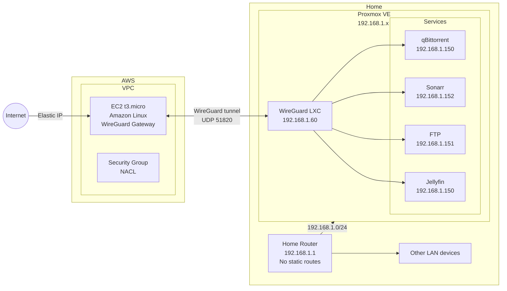
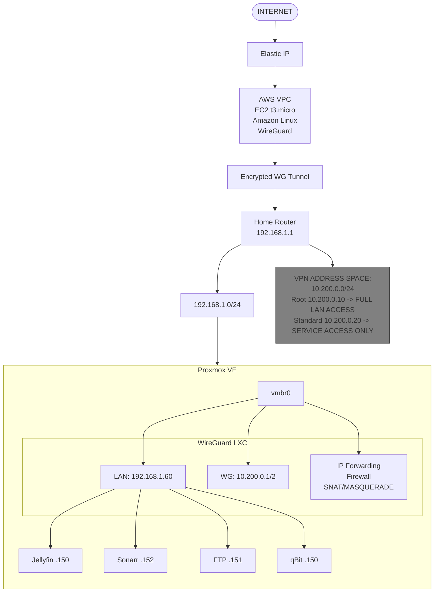
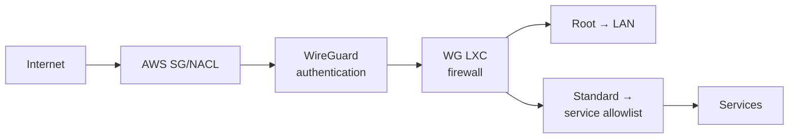
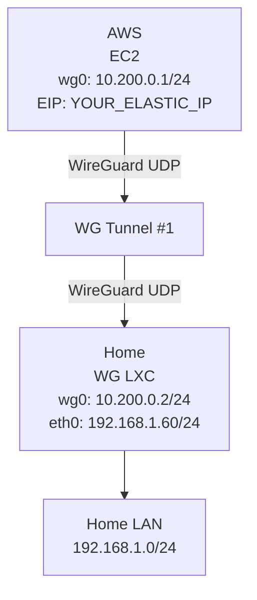
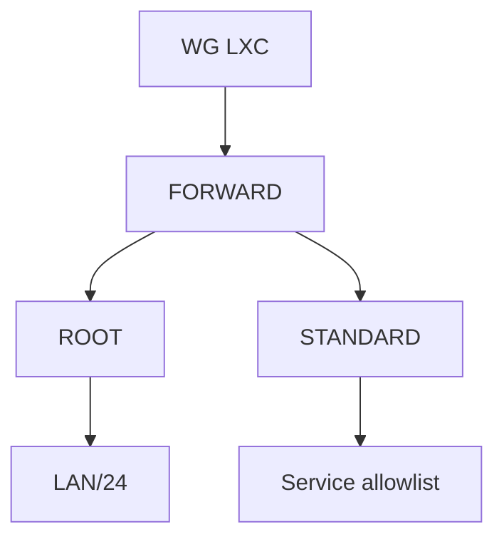
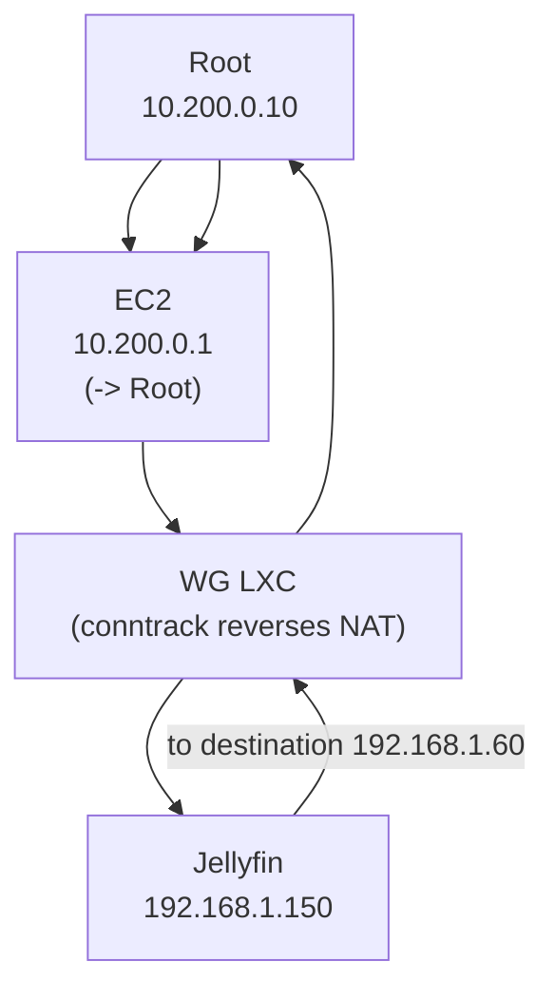

# Homelab VPN — High-Level & Low-Level Design

## High-Level Architecture




## Addressing Plan

The VPN address space should be kept completely separate from the home LAN, using conventional private (RFC1918) space rather than a public-looking range, to avoid routing conflicts.

| Component | Address |
|---|---|
| Home LAN | 192.168.1.0/24 |
| Router | 192.168.1.1 |
| WireGuard LXC LAN | 192.168.1.60 |
| Jellyfin | 192.168.1.150 |
| FTP | 192.168.1.151 |
| Sonarr | 192.168.1.152 |
| qBittorrent | 192.168.1.150 |
| VPN network | 10.200.0.0/24 |
| EC2 (wg0) | 10.200.0.1 |
| WG LXC (wg0) | 10.200.0.2 |
| Root client | 10.200.0.10 |
| Standard client | 10.200.0.20 |

## The Critical Part: Return Traffic

Suppose the Root client (10.200.0.10) sends a request to Jellyfin (192.168.1.150). The incoming packet looks like:

```
SRC = 10.200.0.10
DST = 192.168.1.150
```

Jellyfin needs to respond with `SRC = 192.168.1.150, DST = 10.200.0.10`, but its default gateway is `192.168.1.1`, and the router has no route for `10.200.0.0/24`. Without intervention, the response would go nowhere useful.

### Solution: SNAT on the WireGuard LXC

The WireGuard LXC should perform SNAT/MASQUERADE when VPN traffic enters the home LAN:

```
BEFORE NAT                          AFTER NAT
SRC: 10.200.0.10          SNAT      SRC: 192.168.1.60
DST: 192.168.1.150        ──────►   DST: 192.168.1.150
```

Jellyfin now believes `192.168.1.60` (the WG LXC) is connecting to it, and replies accordingly. The WG LXC's conntrack/NAT state reverses the translation on the way back, forwarding the reply through WireGuard to `10.200.0.10`. The home router only ever sees normal LAN-to-LAN traffic (`192.168.1.60 ↔ 192.168.1.150`), so **no static route on the home router is required**.

## Traffic Flow: Root

Root has full access to the home network.

```
Root (10.200.0.10) -> WG LXC -> 192.168.1.0/24 (entire LAN, including Proxmox mgmt, router, other devices)
```

Firewall policy: `10.200.0.10 -> 192.168.1.0/24 ALLOW`

## Traffic Flow: Standard

Standard should not have arbitrary access to `192.168.1.0/24`. The WireGuard LXC firewall should implement an allowlist, e.g.:

```
10.200.0.20 -> 192.168.1.150:8096   ALLOW (Jellyfin)
10.200.0.20 -> 192.168.1.151:21     ALLOW (FTP)
10.200.0.20 -> 192.168.1.150:8080   ALLOW (qBittorrent)

10.200.0.20 -> 192.168.1.1          DENY (router)
10.200.0.20 -> 192.168.1.185        DENY
10.200.0.20 -> other LAN devices    DENY
```

**Important:** Do not rely solely on `AllowedIPs` on the client for security. `AllowedIPs = 192.168.1.0/24` only controls what traffic the client *routes* through WireGuard — it is not a sufficient authorization mechanism. The WireGuard LXC firewall must enforce the actual access policy.

## AWS EC2's Role

The EC2 instance should be kept deliberately simple. Its job is just to be the publicly reachable WireGuard endpoint — it doesn't need to understand Jellyfin, Sonarr, FTP, qBittorrent, or any individual homelab service. It just provides the tunnel endpoint so the home ISP connection doesn't need to expose WireGuard directly.

```
Internet -> UDP 51820 -> Elastic IP -> EC2 (WG endpoint) -> WG tunnel -> WG LXC at home -> Home LAN
```

There are effectively two WireGuard hops:

```
Root (10.200.0.10) -> EC2 (10.200.0.1, public WG gateway)
                    -> WG tunnel
                    -> WG LXC (10.200.0.2, home-side WG gateway)
                    -> 192.168.1.0/24
```

EC2 acts as the public endpoint and VPN router; the LXC handles home-network routing, firewalling, and SNAT. This separation avoids double-NATing and keeps EC2 from becoming an unrestricted bridge into the home LAN.

## WireGuard Peer Roles

**Root**
- Public key: `ROOT_PUBLIC_KEY`
- VPN IP: `10.200.0.10/32`
- Access: `10.200.0.10 -> 192.168.1.0/24` (full LAN)

**Standard**
- Public key: `STANDARD_PUBLIC_KEY`
- VPN IP: `10.200.0.20/32`
- Access: `10.200.0.20 -> Jellyfin, FTP, qBittorrent` only (explicit allowlist)

## Firewall Architecture

The primary authorization point sits on the WG LXC, with a default-deny posture:

```
FORWARD policy = DROP

ALLOW: ROOT -> HOME_LAN
ALLOW: STANDARD -> ALLOWED_SERVICES
ALLOW: ESTABLISHED/RELATED return traffic
```

## Design Option Comparison

### Option A — NAT at WG LXC (Recommended)

```
VPN client -> WG LXC -> SNAT -> Home LAN
```

**Advantages:** no static route required on the router; simple; works with the existing home network; easy to troubleshoot; services don't need route configuration; router remains completely unaware of the VPN subnet.

**Disadvantage:** services see the WG LXC's IP instead of the actual client's IP (e.g., Jellyfin logs `192.168.1.60` rather than `10.200.0.10`), which may matter for auditing.

### Option B — Routed VPN Without NAT

```
VPN client (10.200.0.10) -> WG LXC (192.168.1.60) -> Home Router (192.168.1.1) -> 10.200.0.0/24
```

This requires the router to have a static route: `10.200.0.0/24 via 192.168.1.60`. Jellyfin would then see the real client IP (`10.200.0.10`). Since my home router doesn't support static routes, this option isn't practical without replacing/adding a routing appliance — **Option A (SNAT/MASQUERADE) is the recommended approach.**

## Proxmox Networking

The WireGuard LXC is a normal LAN-connected container on the Proxmox bridge (e.g. `vmbr0`), alongside the other service LXCs. It needs:

- IP forwarding
- Firewall
- WireGuard
- NAT (SNAT/MASQUERADE)

The other LXCs (Jellyfin, Sonarr, etc.) don't need to know anything about WireGuard — they just see normal LAN traffic from `192.168.1.60`.

## End-to-End Packet Flow (Root -> Jellyfin)

```
Root (10.200.0.10)
   │  WireGuard
   ▼
EC2 (10.200.0.1, WG server) — routes 192.168.1.0/24 to WG LXC peer
   │  WireGuard tunnel
   ▼
WG LXC (10.200.0.2 / 192.168.1.60)
   │  SNAT: SRC 10.200.0.10 -> 192.168.1.60
   ▼
Jellyfin (192.168.1.150)
   │  response to 192.168.1.60
   ▼
WG LXC — conntrack reverses NAT back to 10.200.0.10
   │
   ▼
EC2 -> Root
```

Jellyfin never needs to know `10.200.0.0/24` exists — that is what makes this architecture compatible with a router that doesn't support static routing.

## DNS (Optional Enhancement)

Instead of clients using raw IP:port combinations (`192.168.1.150:8096`, `192.168.1.151:21`, `192.168.1.150:8080`), internal DNS could be introduced:

```
jellyfin.home -> 192.168.1.150
sonarr.home   -> 192.168.1.152
qbit.home     -> 192.168.1.150
ftp.home      -> 192.168.1.151
```

The WG LXC could forward DNS to the existing home DNS/router, or a dedicated resolver (e.g. Pi-hole/AdGuard Home) could be run separately. This isn't required for the VPN itself but improves usability.

## Final High-Level Design



## Security Boundaries



Jellyfin, qBittorrent, FTP, Proxmox, etc. should **not** be exposed directly through the EC2 instance — only WireGuard's UDP port should be Internet-facing.

**Note:** Since the EC2 instance is purely acting as the public WireGuard endpoint, the tunnel design must account for forwarding between EC2 and the home peer, rather than treating EC2 merely as a conventional client. The exact routing/NAT setup on EC2 depends on whether it's meant to be a layer-3 hub, a relay, or simply terminate the tunnel.

---

# Low-Level Design / Configuration

There are two WireGuard tunnels in this topology: clients connect to EC2, and EC2 connects to the home WG LXC. `AllowedIPs` on EC2 must be defined deliberately so EC2 knows where each network lives — it acts as both a cryptographic peer selector and a routing selector.



## 1. Final Addressing Plan

**AWS**
- EC2 Public/EIP: `<YOUR_ELASTIC_IP>`
- EC2 wg0: `10.200.0.1/24`

**Home**
- Home router: `192.168.1.1`
- WG LXC eth0: `192.168.1.60/24`
- WG LXC wg0: `10.200.0.2/24`

**VPN clients**
- Root: `10.200.0.10/32`
- Standard: `10.200.0.20/32`

**Services**
- Jellyfin: `192.168.1.150`
- FTP: `192.168.1.151`
- Sonarr: `192.168.1.152`
- qBittorrent: `192.168.1.150`

## 2. EC2 WireGuard Configuration

The EC2 instance is the central WireGuard hub.

`/etc/wireguard/wg0.conf`:

```ini
[Interface]
Address = 10.200.0.1/24
ListenPort = 51820
PrivateKey = <EC2_PRIVATE_KEY>

# Enable forwarding/routing
PostUp = sysctl -w net.ipv4.ip_forward=1

[Peer]
# Proxmox WireGuard LXC
PublicKey = <WG_LXC_PUBLIC_KEY>
AllowedIPs = 10.200.0.2/32, 192.168.1.0/24

[Peer]
# Root client
PublicKey = <ROOT_PUBLIC_KEY>
AllowedIPs = 10.200.0.10/32

[Peer]
# Standard client
PublicKey = <STANDARD_PUBLIC_KEY>
AllowedIPs = 10.200.0.20/32
```

The key line is `AllowedIPs = 10.200.0.2/32, 192.168.1.0/24` for the home WG LXC peer. This tells WireGuard: if EC2 receives traffic destined for `192.168.1.0/24`, send it through the tunnel to the LXC.

## 3. EC2 IP Forwarding

Create `/etc/sysctl.d/99-wireguard.conf`:

```
net.ipv4.ip_forward = 1
```

Apply and verify:

```bash
sudo sysctl --system
sysctl net.ipv4.ip_forward
# Expected: net.ipv4.ip_forward = 1
```

## 4. EC2 Firewall (AWS Security Group)

Inbound:

```
UDP 51820  Source: 0.0.0.0/0   ALLOW
```

Restrict the source further if clients have known static public IPs; for roaming/mobile clients, `0.0.0.0/0` is generally required. The Security Group should **not** expose Jellyfin, FTP, or qBittorrent ports:

```
UDP 51820 -> EC2   ALLOW
TCP 8096  -> EC2   DENY
TCP 21    -> EC2   DENY
TCP 8080  -> EC2   DENY
everything else    DENY
```

## 5. WG LXC Configuration

The LXC has `eth0 = 192.168.1.60/24` and `wg0 = 10.200.0.2/24`.

`/etc/wireguard/wg0.conf`:

```ini
[Interface]
Address = 10.200.0.2/24
PrivateKey = <WG_LXC_PRIVATE_KEY>

PostUp = sysctl -w net.ipv4.ip_forward=1

[Peer]
# AWS EC2
PublicKey = <EC2_PUBLIC_KEY>
Endpoint = <EC2_ELASTIC_IP>:51820
AllowedIPs = 10.200.0.0/24
PersistentKeepalive = 25
```

Note that the LXC does **not** use `AllowedIPs = 0.0.0.0/0` — its normal internet traffic should not route through AWS. Its tunnel is specifically for `10.200.0.0/24`.

## 6. Why PersistentKeepalive

The LXC sits behind the home router/NAT and initiates the connection outward toward EC2. `PersistentKeepalive = 25` keeps the NAT mapping alive, which is particularly useful because my home network is behind CGNAT/NAT and EC2 holds the public IP. This means inbound WireGuard connectivity to the home network is never required.

## 7. Enable Forwarding on the LXC

Create `/etc/sysctl.d/99-wireguard.conf`:

```
net.ipv4.ip_forward = 1
```

```bash
sudo sysctl --system
sysctl net.ipv4.ip_forward
```

## 8. The Crucial NAT Rule

Traffic arrives at the LXC as `SRC = 10.200.0.10, DST = 192.168.1.150`. It must be translated, so that home service sees `192.168.1.60 -> 192.168.1.150`:

```bash
iptables -t nat -A POSTROUTING \
    -s 10.200.0.0/24 \
    -d 192.168.1.0/24 \
    -o eth0 \
    -j MASQUERADE
```

This is the rule that eliminates the static-route requirement on the home router.

## 9. Firewall Policy Structure



## 10–13. Firewall Rules

**Root — full LAN access:**

```bash
iptables -A FORWARD \
    -s 10.200.0.10/32 \
    -d 192.168.1.0/24 \
    -j ACCEPT
```

**Standard — explicit service allowlist:**

```bash
# Jellyfin
iptables -A FORWARD \
    -s 10.200.0.20/32 \
    -d 192.168.1.150/32 \
    -p tcp --dport 8096 \
    -j ACCEPT

# FTP
iptables -A FORWARD \
    -s 10.200.0.20/32 \
    -d 192.168.1.151/32 \
    -p tcp --dport 21 \
    -j ACCEPT

# qBittorrent
iptables -A FORWARD \
    -s 10.200.0.20/32 \
    -d 192.168.1.150/32 \
    -p tcp --dport 8080 \
    -j ACCEPT
```

**Established/related traffic:**

```bash
iptables -A FORWARD \
    -m conntrack \
    --ctstate ESTABLISHED,RELATED \
    -j ACCEPT
```

**Default deny:**

```bash
iptables -P FORWARD DROP
```

## 14. Client Configuration — Root

```ini
[Interface]
PrivateKey = <ROOT_PRIVATE_KEY>
Address = 10.200.0.10/32
DNS = 192.168.1.1

[Peer]
PublicKey = <EC2_PUBLIC_KEY>
Endpoint = <EC2_ELASTIC_IP>:51820
AllowedIPs = 10.200.0.0/24, 192.168.1.0/24
PersistentKeepalive = 25
```

`AllowedIPs = 10.200.0.0/24, 192.168.1.0/24` routes all home-LAN traffic through the VPN.

## 15. Client Configuration — Standard

```ini
[Interface]
PrivateKey = <STANDARD_PRIVATE_KEY>
Address = 10.200.0.20/32

[Peer]
PublicKey = <EC2_PUBLIC_KEY>
Endpoint = <EC2_ELASTIC_IP>:51820
AllowedIPs = 10.200.0.0/24, 192.168.1.150/32, 192.168.1.151/32, 192.168.1.152/32
PersistentKeepalive = 25
```

This provides defense in depth: the Standard client itself only routes the specific service IPs (Jellyfin, FTP, qBittorrent) into the VPN, and normally won't even send traffic for other LAN IPs into WireGuard. The actual security boundary, however, remains the WG LXC firewall.

## 16. EC2 Routing Requirement

When Root sends `10.200.0.10 -> 192.168.1.150`, EC2 receives it on `wg0` and must know to route `192.168.1.0/24` to the WG LXC peer. This is established by:

```ini
[Peer]
PublicKey = <WG_LXC_PUBLIC_KEY>
AllowedIPs = 10.200.0.2/32, 192.168.1.0/24
```

WireGuard creates the appropriate route for the peer, so EC2's effective routing table is:

```
10.200.0.0/24  -> wg0
192.168.1.0/24 -> wg0 / WG-LXC peer
```

`AllowedIPs` functions as both a cryptographic peer selector and a routing selector, which is why it must be defined precisely.

## 17. Complete Return Path



The router only ever sees `192.168.1.60 ↔ 192.168.1.150`, which is ordinary LAN traffic — no static route is required.

## 18. Implementation Recommendation

Rather than implementing this directly with raw `iptables` commands, the LLD should be built around **WireGuard + nftables + systemd**, with rules made persistent and auditable (Amazon Linux and the Proxmox LXC's networking stack may use different firewall backends — iptables-nft vs. native nftables). Explicit anti-leak rules should also be added to prevent the Standard client from reaching sensitive addresses even if `AllowedIPs` is later broadened by mistake, e.g.:

```
DENY: Standard -> 192.168.1.1     (router)
DENY: Standard -> 192.168.1.60    (WG LXC)
DENY: Standard -> 10.200.0.1      (EC2 wg0)
DENY: Standard -> 10.200.0.2      (WG LXC wg0)
DENY: Standard -> 192.168.1.185   (Proxmox management interface)
```

## Implementation Order

1. EC2 `wg0.conf`
2. EC2 iptables rules
3. LXC `wg0.conf`
4. LXC iptables/NAT rules
5. Root client config
6. Standard client config
7. AWS Security Group rules
8. Connectivity / security test matrix

Validating each hop independently in this order avoids debugging the whole tunnel at once.
