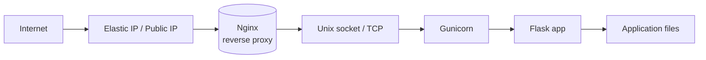

# 🚀 Project – Hosting a Flask App on EC2 with Gunicorn & Nginx

## 📌 Project Information

| Item               | Details                                              |
| ------------------ | ---------------------------------------------------- |
| **Project Name**   | Hosting Flask on EC2 with Gunicorn & Nginx           |
| **Project Status** | ✅ Completed                                          |
| **Difficulty**     | ⭐ Intermediate                                       |
| **Estimated Time** | *1–2 Hours*          |
| **Date Completed** | *18 September 2026*                                  |
| **AWS Region**     | *us-east-1*                 |

---

## 📖 Project Overview

This project documents deploying a Python Flask application to an Ubuntu EC2 instance, using Gunicorn as the WSGI server and Nginx as a reverse proxy. The README records the configuration, implementation steps, provisioning performed on the instance, observed issues, debugging steps, and future improvements.

The goal was not only to serve a working app, but to run it as a system service, secure it with Nginx, and make the deployment repeatable.

---

## 🎯 Project Objective

Deploy a production-ready Flask application on EC2 with the following outcomes:

- Serve the application via Gunicorn bound to a Unix socket.
- Use Nginx as a reverse proxy and static file handler.
- Run Gunicorn under `systemd` for reliability and restart on failure.
- Document the provisioning steps used during the project.
- Document achieved configuration, troubleshooting, and follow-ups.

---

## 🛠 AWS Services Used

| AWS Service      | Purpose                                           |
| ---------------- | ------------------------------------------------- |
| Amazon EC2       | Compute (Ubuntu instance)                         |
| Security Group   | Network access control (SSH, HTTP, HTTPS)         |
| Key Pair         | SSH authentication                                |
| Amazon EBS       | Instance root and persistent storage              |

---

## 🧠 Skills Practiced

* Linux server administration (Ubuntu)
* Python virtual environments and packaging
* Gunicorn WSGI configuration
* Nginx reverse proxy setup
* systemd service authoring
* Server provisioning and setup

---

## 🏗 Architecture



---

## 🔧 Configuration Details

**Operating System**

Ubuntu Server 22.04 LTS or 24.04 LTS (AMIs vary by region)

**Instance Type**

t3.micro (or choose based on load)

**Authentication**

Use an AWS Key Pair (.pem) for SSH access. Restrict SSH in Security Group to your IP where possible.

**Storage**

8–20 GB gp3 EBS is sufficient for a small Flask site; increase for logs or uploaded assets.

**Network**

VPC: Default or custom VPC
Public Subnet with Public IPv4 (or use Elastic IP)

---

## Instance setup

The Flask application is located at `/home/ubuntu/flask-application` on the EC2 instance and the Python virtual environment lives at `env/app` inside that directory.

Example commands executed on the instance (run as your SSH user with `sudo` where needed):

```bash
# update packages
sudo apt update -y && sudo apt upgrade -y

# install required packages
sudo apt install -y python3 python3-venv python3-pip git nginx

# create application directory and virtualenv
sudo mkdir -p /home/ubuntu/flask-application
sudo chown ubuntu:ubuntu /home/ubuntu/flask-application
cd /home/ubuntu/flask-application
python3 -m venv env/app
source env/app/bin/activate
pip install --upgrade pip
pip install wheel flask gunicorn

# (clone or place flask application files into /home/ubuntu/flask-application)
```

Create a `systemd` service unit to run Gunicorn (example `/etc/systemd/system/gunicorn-wsgi.service`):

```ini
[Unit]
Description=gunicorn daemon for Flask app
After=network.target

[Service]
User=ubuntu
Group=www-data
WorkingDirectory=/home/ubuntu/flask-application
Environment="PATH=/home/ubuntu/flask-application/env/app/bin"
ExecStart=/home/ubuntu/flask-application/env/app/bin/gunicorn --workers 3 --bind unix:/home/ubuntu/flask-application/flaskapp.sock wsgi:app

[Install]
WantedBy=multi-user.target
```

Enable and start the service:

```bash
sudo systemctl daemon-reload
sudo systemctl enable gunicorn-wsgi
sudo systemctl start gunicorn-wsgi
sudo systemctl status gunicorn-wsgi
```

Configure Nginx to proxy to the Unix socket at `/home/ubuntu/flask-application/flaskapp.sock` and restart Nginx after enabling the site.

## Nginx site configuration example

Create `/etc/nginx/sites-available/flask-application` with the following content and replace `server_name` with your domain (or keep `_` for the instance IP):

```nginx
server {
	listen 80;
	server_name _; # replace with example.com or your domain or Elastic IP

	location / {
		include proxy_params;
		proxy_pass http://unix:/home/ubuntu/flask-application/flaskapp.sock;
		proxy_set_header Host $host;
		proxy_set_header X-Real-IP $remote_addr;
		proxy_set_header X-Forwarded-For $proxy_add_x_forwarded_for;
		proxy_set_header X-Forwarded-Proto $scheme;
	}
}
```

Enable the site and reload Nginx:

```bash
sudo ln -s /etc/nginx/sites-available/flask-application /etc/nginx/sites-enabled/
sudo nginx -t
sudo systemctl restart nginx
```

Notes:
- Open port 80 (and 443 for TLS) in the instance Security Group.

---

## Security Group Rules (example)

| Type  | Protocol | Port | Source               |
| ----- | -------- | ---- | -------------------- |
| SSH   | TCP      | 22   | Restrict to your IP  |
| HTTP  | TCP      | 80   | 0.0.0.0/0            |
| HTTPS | TCP      | 443  | 0.0.0.0/0            |

---

## 🚀 Deployment Process (detailed)

1. Launch an Ubuntu EC2 instance with the above Security Group and Key Pair.
2. (Optional) Attach an Elastic IP for a stable public IP.
3. Run the setup commands on the instance.
4. Confirm `gunicorn-wsgi` systemd service is running: `sudo systemctl status gunicorn-wsgi`.
5. Create and enable the Nginx site configuration to proxy to the Unix socket.
6. Test `nginx -t` and `sudo systemctl restart nginx`.
7. Browse to the instance public IP or domain to verify the app is served.

---

## 📸 Screenshots

Include screenshots taken during the project (EC2 dashboard, Security Group settings, Nginx test page, SSH session, app response). Add them to a `screenshots/` directory and reference them here.

---

## ⚠ Challenges Encountered

### Challenge 1 — Gunicorn service fails to start

**Symptoms**: `systemctl status gunicorn-wsgi` showed a crash loop or failed state.

**Cause**: Common causes were incorrect `WorkingDirectory`, wrong `ExecStart` path, or missing virtualenv.

**Resolution**: Checked the `gunicorn-wsgi` unit file, ensured `Environment` PATH pointed to the app venv, and validated `wsgi:app` import from working directory (ensure `wsgi.py` imports `app` from `app.py`). Recreated the venv and reinstalled dependencies. Use `sudo journalctl -u gunicorn-wsgi -b` to read runtime errors.

### WSGI entry-point (`wsgi.py`)

Create a `wsgi.py` file at the project root that exposes the Flask application object. Example `wsgi.py`:

```python
from app import app

if __name__ == '__main__':
	app.run()
```

Gunicorn should be invoked with the module and callable: `wsgi:app` (module:callable). This matches the `ExecStart` shown above.

If your project uses a package layout, adjust imports accordingly (for example, `from mypackage.app import app` and use `mypackage.wsgi:app` when starting Gunicorn).

### Challenge 2 — Nginx returns 502 Bad Gateway

**Symptoms**: Nginx served a 502 when proxying to Gunicorn socket.

**Cause**: Socket file missing or permission mismatch between `ubuntu` and `www-data` (Nginx worker group).

**Resolution**: Confirmed socket path (`/home/ubuntu/flask-application/flaskapp.sock`) exists, adjusted systemd `ExecStart` and `Umask` if needed, and ensured socket group ownership or set `Group=www-data` for Gunicorn. Reloaded systemd and restarted Gunicorn and Nginx.

### Challenge 3 — Permissions and SELinux/AppArmor

**Symptoms**: Permission denied when Nginx attempted to access socket or files.

**Cause**: On Ubuntu AppArmor profiles may restrict access, or file ownership was incorrect.

**Resolution**: Checked AppArmor logs (`dmesg`/`journalctl`) and adjusted policies where necessary, but most often fixing file ownership/permissions solved the issue: `chown -R ubuntu:www-data /home/ubuntu/flask-application` and set `chmod 750` on directories.

---

## 📚 Key Concepts Learned

- Gunicorn is a production WSGI server and should be run behind a reverse proxy.
- Nginx can proxy to Unix sockets or TCP; Unix sockets avoid local TCP overhead and are common for single-host deployments.
- `systemd` provides process lifecycle, automatic restarts, and logging via `journalctl`.
- Provisioning steps were performed on the instance; document the steps to reproduce the environment when needed.

---

## 💡 Lessons Learned

- Always validate paths and environment variables in `systemd` units.
- Start with a small number of `gunicorn` workers and scale after measuring CPU and memory.
- Lock down SSH to a small set of IPs and use a bastion host for secure administration.

---

## 🔄 Future Improvements / Scope

- Add CI/CD pipeline to build and deploy application artifacts automatically.
- Containerize the app using Docker and use ECS/EKS or a managed container service.
- Replace provisioning with Terraform or CloudFormation templates.
- Add monitoring (Prometheus, CloudWatch) and structured logging.
- Autoscaling and load balancing behind an Application Load Balancer for high availability.
- Harden instance security: centralized secrets, IAM roles, and least-privilege Security Groups.

---

## 🔧 Troubleshooting Quick Commands

```bash
sudo journalctl -u gunicorn-wsgi -f
sudo tail -n 200 /var/log/nginx/error.log
sudo nginx -t
sudo systemctl status gunicorn-wsgi nginx
ls -l /home/ubuntu/flask-application/flaskapp.sock
```

---

## 📚 References

- Flask: https://flask.palletsprojects.com/
- Gunicorn: https://gunicorn.org/
- Nginx: https://nginx.org/

---

## 📝 Personal Reflection

This project converted basic knowledge of Flask and Nginx into a reproducible server deployment. Running Gunicorn as a `systemd` service and using a Unix socket with Nginx produced a reliable setup suitable for small production workloads. The main friction points were environment paths, socket permissions, directory/file permissions and DNS/HTTP provisioning.

---

## ✅ Project Summary

The Flask application was deployed and served via Nginx reverse proxy and Gunicorn, provisioned on the instance, and documented here with troubleshooting notes and a roadmap for improvements.

