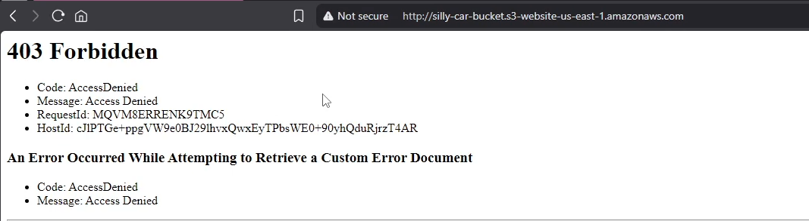

# 🚀 Project 02 – S3 Bucket and Static Website Hosting

## 📌 Project Information

| Item | Details |
|------|---------|
| **Project Name** | S3 Bucket and Static Website Hosting |
| **Project Status** | ✅ Completed |
| **Difficulty** | ⭐ Beginner |
| **Estimated Time** | *10 Minutes* |
| **Date Completed** | *16 July 2026* |
| **AWS Region** | *us-east-1 – N. Virginia* |

---

# 📖 Project Overview

The objective of this project was to create an Amazon S3 bucket and host a static website. Through this project, I learned how Amazon S3 buckets and objects work, how object permissions are managed, and why bucket policies are required for public access.

---

# 🎯 Project Objective

Successfully deployed an Amazon S3 bucket, hosted a static website, and configured bucket policies and permissions to allow public access to the website.

---

# 🛠 AWS Services Used

| AWS Service | Purpose |
|-------------|---------|
| **Amazon S3** | Store website files (objects) in a bucket |
| **Static Website Hosting** | Host and serve static website content |
| **Bucket Policy** | Grant public read access to objects stored in the bucket for static website hosting |

---

# 🧠 Skills Practiced

- AWS Management Console
- Amazon S3
- Static Website Hosting
- Bucket Policies
- Object Management

---

# 🏗 Architecture

```text
                      S3 Bucket
                         │
                         │
                     Website Objects
                         │
                         │
                    Bucket Policy
                         │
                         │
              Static Website Hosting
                         │
                         │
              Public Website Endpoint
```

---

# 🔧 Configuration Details

## Bucket Policy

```json
{
    "Version": "2012-10-17",
    "Statement": [
        {
            "Sid": "sillyCarWebsite",
            "Effect": "Allow",
            "Principal": "*",
            "Action": "s3:GetObject",
            "Resource": "arn:aws:s3:::silly-car-bucket/*"
        }
    ]
}
```

---

# 🚀 Deployment Process

The following steps were performed:

1. Logged into the AWS Management Console.
2. Opened the Amazon S3 Dashboard.
3. Clicked **Create bucket**.
4. Selected the bucket type as **General purpose**.
5. Entered the bucket name: **silly-car-bucket**.
6. Kept **Object Ownership** as **ACLs disabled**.
7. Unchecked **Block all public access** to allow public access.
8. Created the bucket.
9. Uploaded the website files (objects) to the bucket.
10. Opened the **Properties** tab and edited **Static website hosting**.
11. Enabled **Static website hosting** and specified:
    - **Index document:** `index.html`
    - **Error document:** `error.html`
12. Saved the configuration changes.
13. After enabling Static Website Hosting, a bucket website endpoint was generated.
14. Opened the bucket website endpoint URL to verify that the website loaded successfully.
15. Navigated to the **Permissions** tab and added the required bucket policy to allow public read access.

---

# 📸 Screenshots

### S3 Dashboard


### Bucket Creation


### Object Upload


### Static Website Hosting




### Bucket Policy


### Static Website


---

# ⚠ Challenges Encountered

## Challenge 1

### 403 – Forbidden

The first issue I encountered was a **403 – Forbidden** error. I spent around 30 minutes reviewing the bucket permissions and configuration before identifying the root cause.

### Cause

Initially, I assumed that simply disabling **Block all public access** would automatically make the bucket, its objects, and the static website publicly accessible. However, I later learned that a bucket policy is also required to grant public read access to the objects.

### Resolution

After asking ChatGPT for guidance, I realized the missing bucket policy was the issue. I created the appropriate bucket policy under the **Permissions** tab, which resolved the **403 Forbidden** error.

---

## Challenge 2

### 404 – Car Not Found

After fixing the bucket policy, I encountered a **404 – Not Found** error.

### Cause

I quickly realized that I had uploaded the entire project folder instead of uploading the website files directly into the bucket. As a result, the `index.html` file was not located in the root directory, which Amazon S3 expects when serving a static website.

### Resolution

I moved the `index.html` file to the root of the bucket and organized the remaining files into their appropriate locations. After correcting the file structure, the website loaded successfully.

---

# 📚 Key Concepts Learned

During this project, I learned:

- The difference between Amazon S3 buckets and objects.
- How object hierarchy and file structure work in Amazon S3.
- How Static Website Hosting works.
- Why bucket policies are required for public access.
- The relationship between bucket permissions and object accessibility.

---

# 💡 Lessons Learned

This project helped me better understand how Amazon S3 stores objects and how static website hosting works.

One of the biggest lessons I learned was that disabling **Block all public access** alone is not enough. Public access also requires an appropriate bucket policy that grants permission to access the stored objects.

I also learned that Amazon S3 can serve as a simple and cost-effective serverless hosting solution for static websites.

---

# 🔄 Future Improvements

Possible enhancements include:

- Configure lifecycle policies to automatically transition objects to lower-cost storage classes.
- Implement the **Principle of Least Privilege (PoLP)** for object access.
- Secure the website using Amazon CloudFront with HTTPS.
- Register a custom domain using Amazon Route 53.
- Enable versioning for object recovery.

---

# 📚 References

- AWS Official Documentation
- Amazon S3 Documentation
- AWS Skill Builder (Cloud Practitioner Learning Path)
- AWS Free Tier
- Personal Hands-on Practice
